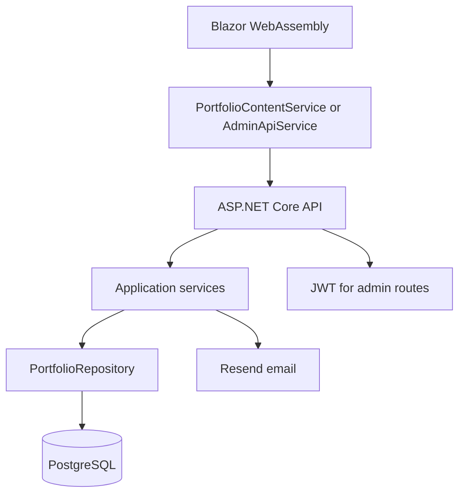
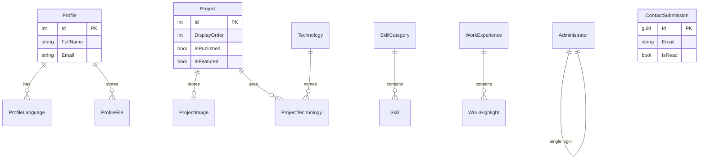

<div align="center">

# PortfolioCite

### A full-stack .NET developer portfolio with a custom admin panel

A Blazor WebAssembly portfolio with an ASP.NET Core API for managing projects, skills, experience, certificates, and contact messages.

[](https://dotnet.microsoft.com/)
[](https://dotnet.microsoft.com/apps/aspnet/web-apps/blazor)
[](https://learn.microsoft.com/ef/core/)
[](https://www.postgresql.org/)

</div>

## Live Demo

[](https://portfolio-cite-six.vercel.app)

## Overview

PortfolioCite is a personal portfolio split into a public site and a private admin. Visitors read the profile, skills, work history, certificates, and projects, and can send a contact message. The owner signs in and edits that content through the same Blazor application.

The browser hosts the UI. The API owns authentication, validation, and data access. Entity Framework Core stores the portfolio in PostgreSQL. Avatar, resume, and project image bytes are stored in that database and served by the API. Contact notifications are sent with [Resend](https://resend.com/).

The public project catalogue lists every project. A separate flag, stored as `IsPublished`, controls only whether a project appears in **Selected systems** on the home page. At most three projects can be marked for the home page.

## Features

- Public home page with profile, about, skills, experience, and up to three selected projects
- Full project catalogue, ordered by display order, including projects that are hidden from the home page
- Certificates page and a contact form
- Admin for profile, languages, avatar, resume, projects, skills, experience, education, certificates, contact links, and messages
- Home-page project selection limited to three projects, enforced by the API
- Project, skill, certificate, experience, education, language, and contact-link ordering
- JPEG, PNG, WebP, and GIF uploads for the avatar and project image, stored in PostgreSQL
- JWT sign-in for a single administrator, with the access token kept in `sessionStorage`
- Contact form honeypot and per-IP rate limits on contact submissions and admin login
- Automatic EF Core migrations and optional first-admin provisioning when the API starts
- Swagger UI in the Development environment
- A Docker image for the API on port 8080

## Getting Started

### Prerequisites

- [.NET 9 SDK](https://dotnet.microsoft.com/download/dotnet/9.0)
- PostgreSQL
- A Resend API key if you want contact emails. The message is still stored when email delivery fails.

### Clone

```bash
git clone https://github.com/OleksandrHutsul/PortfolioCite.git
cd PortfolioCite
```

### Configuration

The API reads `server/PortfolioCite.Api/appsettings.json` and `appsettings.Development.json`. Committed files leave secrets empty. Set them with [user secrets](https://learn.microsoft.com/aspnet/core/security/app-secrets) or environment variables. The API project already has a user-secrets id.

```bash
dotnet user-secrets set "ConnectionStrings:PortfolioDatabase" "Host=localhost;Port=5432;Database=portfoliocite;Username=postgres;Password=your-password" --project server/PortfolioCite.Api
dotnet user-secrets set "Jwt:SigningKey" "a-local-signing-key-at-least-32-characters" --project server/PortfolioCite.Api
dotnet user-secrets set "InitialAdmin:Email" "you@example.com" --project server/PortfolioCite.Api
dotnet user-secrets set "InitialAdmin:Password" "a-password-of-at-least-12-characters" --project server/PortfolioCite.Api
dotnet user-secrets set "Email:ApiKey" "re_your_resend_key" --project server/PortfolioCite.Api
```

`Jwt:SigningKey` must contain at least 32 characters. The API validates issuer, audience, signing key, and token lifetime on startup and will not run when those checks fail. `AccessTokenMinutes` is 60.

`InitialAdmin` is used only when the `Administrators` table is empty. Leave both email and password empty to skip provisioning. If either value is set, the email must be valid and the password must be at least 12 characters.

`Email:FromAddress` defaults to `onboarding@resend.dev` and `Email:FromName` to `PortfolioCite`. The notification is sent to the email stored on the portfolio profile, not to `FromAddress`.

Development CORS allows `https://localhost:7187` and `http://localhost:5087`. The base `appsettings.json` also allows the deployed site `https://portfolio-cite-six.vercel.app`.

The Blazor client reads `client/PortfolioCite.App/wwwroot/appsettings.json`:

```json
"PortfolioApi": {
  "BaseUrl": "https://portfoliocite.onrender.com"
}
```

That value is the deployed API. For a local API, point it at the HTTPS profile before starting the client:

```json
"PortfolioApi": {
  "BaseUrl": "https://localhost:7254"
}
```

The client calls this URL from the browser, so the API must allow that origin.

### Database

PortfolioCite uses PostgreSQL through EF Core and Npgsql. `PortfolioDbContext` is in `server/PortfolioCite.Infrastructure/Data`. On startup `Program.cs` calls `Database.MigrateAsync()`, then creates the first administrator when `InitialAdmin` is configured and no administrator exists.

Create an empty database before the first run. You do not need to run `dotnet ef database update` to start the API. Migrations live in `server/PortfolioCite.Infrastructure/Data/Migrations` and create the profile, projects, skills, career, certificates, contact links, contact messages, and administrator tables. Avatar, resume, and project image content are columns in that database, not files on disk.

### Run locally

Start the API from the repository root. The `https` profile matches the local client origin and serves Swagger:

```bash
dotnet run --project server/PortfolioCite.Api --launch-profile https
```

The API listens on [https://localhost:7254](https://localhost:7254) and [http://localhost:5091](http://localhost:5091). Swagger is at [https://localhost:7254/swagger](https://localhost:7254/swagger).

In a second terminal, start the client. The `http` profile is listed first:

```bash
dotnet run --project client/PortfolioCite.App
```

This opens [http://localhost:5087](http://localhost:5087). The `https` profile uses [https://localhost:7187](https://localhost:7187) and [http://localhost:5087](http://localhost:5087):

```bash
dotnet run --project client/PortfolioCite.App --launch-profile https
```

The public site is the root URL. Admin sign-in is [http://localhost:5087/admin/login](http://localhost:5087/admin/login). After sign-in, the admin home is `/admin`.

## How It Works



1. `PortfolioCite.App` starts in the browser and registers `PortfolioContentService` and `AdminApiService` against `PortfolioApi:BaseUrl`.
2. Public pages call `GET /api/portfolio` for the home snapshot, `GET /api/projects` for the catalogue, and `POST /api/contact` for a message.
3. Admin pages send `POST /api/auth/login`, store the JWT in `sessionStorage`, and attach it to later `/api/admin/*` requests.
4. Controllers call application services. Those services validate content and use `PortfolioRepository`.
5. EF Core reads and writes PostgreSQL. A stored contact message is then emailed to the profile address through Resend. If that send fails, the message remains in the database.

## Public Site

| Route | What it shows |
| --- | --- |
| `/` | Profile, about, skills, experience, and up to three projects marked for the home page |
| `/projects` | Every project, ordered by `DisplayOrder` |
| `/certificates` | Certificates, ordered by `DisplayOrder` |
| `/contact` | Profile email, contact links, and the message form |

The home page loads one portfolio snapshot. **Selected systems** keeps projects whose `IsPublished` flag is true, sorts them by `DisplayOrder`, and shows at most three. **View all projects** links to `/projects`.

`/projects` does not apply that flag. A project hidden from the home page is still part of the catalogue.

The contact form posts name, email, subject, and message. A hidden `Website` field is a honeypot: a non-empty value returns `202 Accepted` and does not store a row. Real submissions are limited to 5 requests per 10 minutes for each IP address.

## Admin

`/admin/login` exchanges email and password for a JWT. The token is stored in `sessionStorage` and sent as a bearer token. Admin routes require the `Admin` role. Login attempts are limited to 5 per 5 minutes for each IP address.

| Route | What it edits |
| --- | --- |
| `/admin` | Links to the other admin sections |
| `/admin/profile` | Name, role, location, summary, focus, email, languages, avatar, and resume |
| `/admin/projects` | Project list, home-page selection, and display order |
| `/admin/projects/{id}` | One project, including its image |
| `/admin/skills` | Skill categories and skills |
| `/admin/experience` | Work history |
| `/admin/education` | Education |
| `/admin/certificates` | Certificates |
| `/admin/contact-links` | Links shown on the contact page |
| `/admin/messages` | Stored contact messages |

The project checkbox is labeled **Show on home page**. It writes the existing `IsPublished` field. It does not create a second visibility flag, and it does not remove the project from `/projects`. The API rejects a fourth project being marked for the home page with: “Only 3 projects can be visible on the home page. Hide another project first.” Saving a project that is already marked for the home page is still allowed.

## Database

PostgreSQL is accessed only through `PortfolioDbContext`.



`IsPublished` means “show this project on the home page.” `IsFeatured` is still stored and can render a Featured badge on a project card. The admin editor does not expose that checkbox; a save keeps the value already loaded for that project.

`ProfileFile` holds the avatar and resume. `ProjectImage` holds one image per project. Public image and file URLs are API routes under `/api/portfolio`.

`Administrator` stores a normalized email and a hashed password. There is no public user account.

`ContactSubmission` stores the message even when the Resend notification fails. The admin messages page can mark a message read or delete it.

## Architecture

The solution has six projects. There is no automated test project.

```text
PortfolioCite.App
        ↓
PortfolioCite.Contracts
        ↑
PortfolioCite.Api
        ↓
PortfolioCite.Application
        ↓
PortfolioCite.Domain
        ↑
PortfolioCite.Infrastructure
```

**PortfolioCite.App** is the Blazor WebAssembly client. It contains the public pages, admin pages, layouts, and the HTTP services. It references `PortfolioCite.Contracts`.

**PortfolioCite.Api** is the ASP.NET Core host. It contains controllers, JWT setup, CORS, rate limits, Swagger, startup migrations, and first-admin provisioning. It references Application, Infrastructure, and Contracts.

**PortfolioCite.Application** contains the use cases: portfolio queries, project editing, profile and career management, contact, and authentication. It does not reference EF Core.

**PortfolioCite.Domain** contains the entity types.

**PortfolioCite.Infrastructure** contains `PortfolioDbContext`, migrations, `PortfolioRepository`, and `ResendEmailService`.

**PortfolioCite.Contracts** contains the request and response models shared by the client and the API, including `ProjectVisibilityRules`.

## Project Structure

```text
PortfolioCite/
├── Dockerfile
├── PortfolioCite.sln
├── PortfolioCite.Contracts/
├── client/
│   └── PortfolioCite.App/
│       ├── Components/
│       │   ├── Layout/
│       │   ├── Pages/
│       │   └── Shared/
│       ├── Services/
│       ├── wwwroot/
│       │   ├── appsettings.json
│       │   └── css/app.css
│       └── Program.cs
└── server/
    ├── PortfolioCite.Api/
    │   ├── Controllers/
    │   ├── Program.cs
    │   └── appsettings.json
    ├── PortfolioCite.Application/
    ├── PortfolioCite.Domain/
    └── PortfolioCite.Infrastructure/
        ├── Data/Migrations/
        └── Email/ResendEmailService.cs
```

## Tech Stack

| Area | Technology |
| --- | --- |
| Runtime | .NET 9 |
| Public and admin UI | Blazor WebAssembly |
| API | ASP.NET Core controllers |
| Auth | JWT bearer, ASP.NET Core Identity password hasher |
| ORM | Entity Framework Core 9 |
| Database | PostgreSQL (`Npgsql.EntityFrameworkCore.PostgreSQL` 9.0.4) |
| Email | Resend 0.22.0 |
| API docs | Swashbuckle, Development only |
| API image | Docker (`mcr.microsoft.com/dotnet/aspnet:9.0`) |

## Docker

The `Dockerfile` publishes `PortfolioCite.Api` only. The Blazor client is not inside the image. The container listens on HTTP port 8080 (`ASPNETCORE_URLS=http://+:8080`).

The API still needs a PostgreSQL connection string, a JWT signing key, and any email or initial-admin settings. Pass them as environment variables. ASP.NET Core maps `__` to nested configuration keys:

```bash
docker build -t portfoliocite-api .
docker run -p 8080:8080 \
  -e ConnectionStrings__PortfolioDatabase="Host=host.docker.internal;Port=5432;Database=portfoliocite;Username=postgres;Password=your-password" \
  -e Jwt__SigningKey="a-local-signing-key-at-least-32-characters" \
  portfoliocite-api
```

Open [http://localhost:8080/swagger](http://localhost:8080/swagger) only when `ASPNETCORE_ENVIRONMENT` is `Development`. Swagger is not registered outside Development. The site UI stays on the Blazor host and must use this API URL as `PortfolioApi:BaseUrl`. CORS must include that site origin.

Startup applies EF Core migrations to the database named in the connection string. Replacing the container does not replace PostgreSQL data when the database runs outside the container.

## Deployment

The committed client configuration calls `https://portfoliocite.onrender.com`. The API CORS list includes `https://portfolio-cite-six.vercel.app`. Those are the current hosted API and site. The repository does not include a CI pipeline.

The API process needs a reachable PostgreSQL database and the same secrets described above. The Blazor client is a static WebAssembly app: publish `PortfolioCite.App` and host the output where it can call the API. Set `PortfolioApi:BaseUrl` to that API before publishing the client.

Avatar, resume, and project images travel with the database. They are not a separate file volume.

## Security and Configuration Notes

- There is one administrator. The public site has no accounts.
- The JWT is stored in `sessionStorage`. Closing the tab ends the admin session when the browser drops that storage.
- Do not commit `ConnectionStrings:PortfolioDatabase`, `Jwt:SigningKey`, `Email:ApiKey`, or `InitialAdmin:Password`.
- `InitialAdmin` creates a user only when the table is empty. Changing the setting later does not reset an existing password.
- Contact and login endpoints are rate limited by remote IP. The contact honeypot accepts bot posts without writing a row.
- Admin controllers require the `Admin` role. Public portfolio and project reads do not.
- A failed login still runs a password verification against a dummy hash, so a missing account does not return faster than a wrong password.

## Current Limitations

- The home page shows at most three projects. The catalogue page shows all of them.
- `IsFeatured` can still show a badge on a card, but the admin UI no longer edits it.
- Contact email is skipped or logged as a failure when the profile has no valid email, or when Resend rejects the request. The message row is kept.
- The Docker image does not serve the Blazor site.
- Swagger is available only in Development.
- The solution does not include an automated test project.
